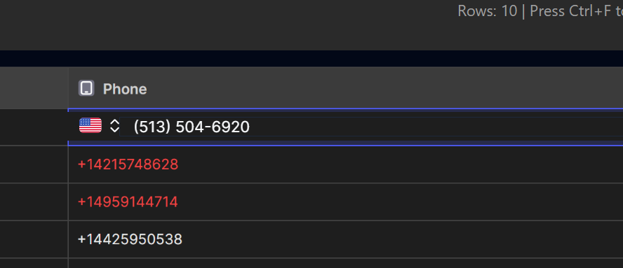
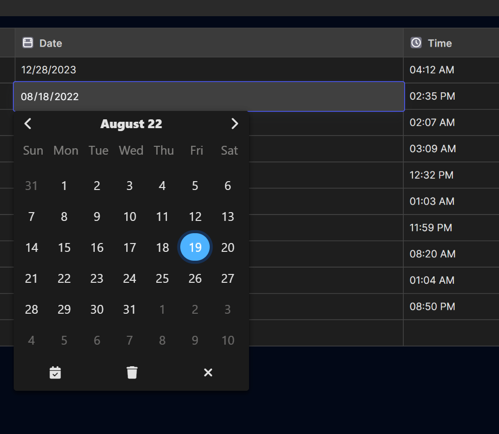

# Glide Custom Cells

[Glide Data Grid](https://github.com/glideapps/glide-data-grid) is a blazing-fast React data-grid from Glide Apps. It supports **custom cell renderers**, letting you embed fully-fledged React components inside table cells. This repository showcases two such custom cells built with **Next.js**:

1. **International Phone Number Cell** –  [phone-input component](https://shadcn-phone-input.vercel.app/).



2. **Date & Time Cell** – built with [Tempus Dominus](https://github.com/tempusdominus/tempusdominus) for a rich calendar / time-picker experience.



These cells are designed to be dropped straight into any Glide Data Grid instance (or another React data grid) while following modern front-end best practices: TypeScript, Tailwind CSS, ESLint/Prettier, and strict type safety.

---

## 📑 Table of Contents
1. [Getting Started](#-getting-started)
2. [Scripts](#-scripts)
3. [Folder Structure](#-folder-structure)
4. [Usage in Glide Data Grid](#-usage-in-glide-data-grid)
5. [Contributing](#-contributing)
6. [License](#-license)

---

## 🚀 Getting Started

1. Clone the repo and install dependencies:

```bash
# SSH
git clone git@github.com:dahshury/glide_custom_cells.git

# or HTTPS
git clone https://github.com/dahshury/glide_custom_cells.git

cd glide_custom_cells
npm install   # or yarn install or pnpm install
```

2. Launch the dev server:

```bash
npm run dev   # Visit http://localhost:3000
```

The project uses **Next.js 14** with the new `app/` directory disabled to keep things simple for Glide embedding.

---

## 🛠 Scripts
| Command | Description |
|---------|-------------|
| `npm run dev` | Start Next.js in development mode with hot reload |
| `npm run build` | Production build |
| `npm run start` | Run the production build locally |
| `npm run lint` | Run ESLint + TypeScript checks |
| `npm run format` | Format code with Prettier |

---

## 📂 Folder Structure
```
.
├─ components/          # Reusable UI primitives & custom cells
│  ├─ ui/               # shadcn-style extracted components
│  └─ …
├─ pages/               # Next.js pages (index preview, _app, _document)
├─ lib/                 # Utility helpers
└─ styles/              # Tailwind CSS & global styles
```

---

## 🔌 Usage in Glide Data Grid
1. Deploy this project (e.g. Vercel, Netlify, or your own server).
2. Copy the embed URL of the specific cell you need (e.g. `/phone-input` or `/date-picker`).
3. In Glide, add a **Web view** component and paste the URL.
4. Use Glide's column values as query-string parameters to pre-populate or receive changes.

> ℹ️ For a complete integration example, see [`pages/index.tsx`](pages/index.tsx).

---

## 🤝 Contributing
Found a bug? Have a feature request? Open an issue or a pull request! Please follow the conventional commit style and ensure `npm run lint` passes before submitting.

---

## 📝 License

Distributed under the MIT License. See `LICENSE` for more information.
